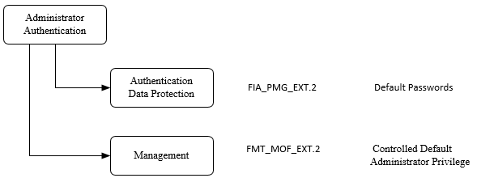
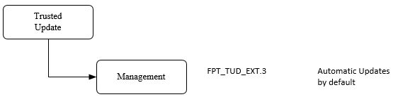
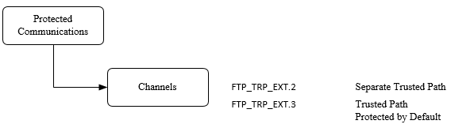

Version 0.5

October 2020

== Acknowledgements

This PP-Module was developed by the Network international Technical Community with representatives from industry, Government agencies, Common Criteria Test Laboratories, and members of academia.

== Preface

=== Objective of Document

This document presents the Common Criteria (CC) PP-Module to express the security functional requirements (SFRs) and security assurance requirements (SARs) for enforcement of Core Protections on a system in addition to the Base-PP for a Network Device specified below. Evaluation Activities for the Base-PP are given in [SD-ND] and the additional Evaluation Activities that specify the actions the evaluator performs to determine whether a product satisfies the additional SFRs captured within this PP-Module are described in [SD-CP].

=== Scope of Document

The scope of the PP-Module within the development and evaluation process is described in the Common Criteria for Information Technology Security Evaluation [CC]. In particular, a PP-Module defines the additional IT security requirements of a generic type of TOE and specifies the functional and assurance security measures to be offered by that TOE to meet stated requirements. A PP-Configuration results from the combination of at least one PP- Module with its Base-PPs, without any additional content (for details see [CC1], section 9.6).

== Intended Readership

The target audiences of this PP-Module are developers, CC consumers, system integrators, evaluators and schemes.

Although the PP-Configuration, PP-Module and SDs may contain minor editorial errors, PP- Modules are recognized as living documents and the iTCs are dedicated to ongoing updates and revisions. Please report any issues to the ND iTC.

=== Related Documents

==== Common Criteria

[CC1] Common Criteria for Information Technology Security Evaluation, Part 1: Introduction and General Model,

____
CCMB-2017-04-001, Version 3.1 Revision 5, April 2017.
____

[CC2] Common Criteria for Information Technology Security Evaluation, Part 2: Security Functional Components,

____
CCMB-2017-04-002, Version 3.1 Revision 5, April 2017.
____

[CC3] Common Criteria for Information Technology Security Evaluation, Part 3: Security Assurance Components,

____
CCMB-2017-04-003, Version 3.1 Revision 5, April 2017.
____

[CEM] Common Methodology for Information Technology Security Evaluation, Evaluation Methodology,

____
CCMB-2017-04-004, Version 3.1, Revision 5, April 2017.
____

{empty}[Exact Conformance Addendum]

____
CC and CEM addenda, Exact Conformance, Selection-Based SFRs, Optional SFRs, May 2017, Version 0.5
____

==== Other Documents

[PP-ND] collaborative Protection Profile for Network Devices, Version 2.1, 24-September-2018

[SD-CP] Evaluation Activities for Core Protections PP-Module, Version TBD

[SD-ND] Evaluation Activities for Network Device cPP, Version 2.1, 17 August 2018

=== Revision History

[width="100%",cols="17%,22%,61%",options="header",]
|===
|Version |Date |Description
|0.1 |September, 2019 |Initial Development of Document
|0.2 |October, 2019 |Revisions based on technical community insights
|0.3 |October, 2019 |Revisions based on technical community insights
|0.4 |August, 2020 |Revisions based on technical community insights
|0.5 |October 2020 |Revisions based on technical community insights
|===

link:#acknowledgements[1. Acknowledgements 2]

link:#preface[2. Preface 3]

link:#objective-of-document[2.1. Objective of Document 3]

link:#scope-of-document[2.2. Scope of Document 3]

link:#intended-readership[3. Intended Readership 3]

link:#related-documents[3.1. Related Documents 3]

link:#common-criteria[3.1.1. Common Criteria 3]

link:#other-documents[3.1.2. Other Documents 4]

link:#revision-history[3.2. Revision History 4]

link:#introduction[4. Introduction 9]

link:#collaborative-protection-profile-for-network-device-ndcpp-v2.2e[4.1. Collaborative Protection Profile for Network Device (NDcPP) v2.2E 9]

link:#pp-module-introduction[4.2. PP-Module Introduction 9]

link:#pp-module-reference-identification[4.2.1. PP-Module Reference Identification 9]

link:#pp-module-toe-overview[4.2.2. PP-Module TOE Overview 9]

link:#pp-module-toe-use-cases[4.2.3. PP-Module TOE Use Cases 9]

link:#consistency-rationale[4.2.4. Consistency Rationale 10]

link:#cc-conformance[5. CC Conformance 11]

link:#pp-module-conformance-claims[5.1. PP-Module Conformance Claims 11]

link:#introduction-to-distributed-toes[6. Introduction to Distributed TOEs 12]

link:#allocation-of-requirements-in-distributed-toes[6.1. Allocation of Requirements in Distributed TOEs 12]

link:#security-problem-definition[7. Security Problem Definition 14]

link:#threats[7.1. Threats 14]

link:#communications-with-the-network-device[7.1.1. Communications with the Network Device 14]

link:#t.nonsecure_channel[7.1.1.1. T.NONSECURE_CHANNEL 14]

link:#timely-updates[7.1.2. Timely Updates 14]

link:#t.unpatched_software[7.1.2.1. T.UNPATCHED_SOFTWARE 14]

link:#administrator-access[7.1.3. Administrator Access 15]

link:#t.unrestricted_access[7.1.3.1. T.UNRESTRICTED_ACCESS 15]

link:#t.default_passwords[7.1.3.2. T.DEFAULT_PASSWORDS 15]

link:#organization-security-policy[7.2. Organization Security Policy 15]

link:#security-objectives[8. Security Objectives 15]

link:#security-objectives-for-the-toe[8.1. Security Objectives for the TOE 15]

link:#o.monitor_debug[8.1.1. O.MONITOR_DEBUG 15]

link:#o.secure_channels[8.1.2. O.SECURE_CHANNELS 15]

link:#o.secure_defaults[8.1.3. O.SECURE_DEFAULTS 16]

link:#o.automatic_updates[8.1.4. O.AUTOMATIC_UPDATES 16]

link:#security-objectives-rationale[8.2. Security Objectives Rationale 16]

link:#coverage-for-objectives-for-the-toe[8.2.1. Coverage for Objectives for the TOE 16]

link:#sufficiency-for-objectives-for-the-toe[8.2.2. Sufficiency for Objectives for the TOE 16]

link:#security-functional-requirements[9. Security Functional Requirements 18]

link:#conventions[9.1. Conventions 18]

link:#sfr-architecture[9.2. SFR Architecture 19]

link:#security-audit-fau[9.3. Security Audit (FAU) 20]

link:#security-audit-data-generation-fau_gen[9.3.1. Security Audit Data Generation (FAU_GEN) 20]

link:#debug-and-recovery-audit-mechanisms-fau_drm_ext.1[9.3.2. Debug and Recovery Audit Mechanisms (FAU_DRM_EXT.1) 21]

link:#fau_drm_ext.1-debug-and-recovery-audit-mechanisms[9.3.2.1. FAU_DRM_EXT.1 Debug and Recovery Audit Mechanisms 21]

link:#identification-and-authentication-fia[9.4. Identification and Authentication (FIA) 21]

link:#password-management-fia_pmg_ext[9.4.1. Password Management (FIA_PMG_EXT) 21]

link:#fia_pmg_ext.2-password-defaults[9.4.1.1. FIA_PMG_EXT.2 Password Defaults 21]

link:#protection-of-the-tsf-fpt[9.1. Protection of the TSF (FPT) 22]

link:#anti-exploitation-capabilities-fpt_aex[9.1.1. Anti-Exploitation Capabilities (FPT_AEX) 22]

link:#fpt_aex_ext.1-anti-exploitation-capabilities[9.1.1.1. FPT_AEX_EXT.1 Anti-Exploitation Capabilities 22]

link:#trusted-update-fpt_tud[9.1.2. Trusted Update (FPT_TUD) 23]

link:#fpt_tud_ext.3-automatic-update-management[9.1.2.1. FPT_TUD_EXT.3 Automatic Update Management 23]

link:#trusted-pathchannels-ftp[9.2. Trusted Path/Channels (FTP) 23]

link:#inter-tsf-trusted-channel-refinement[9.2.1. Inter-TSF Trusted Channel (Refinement) 23]

link:#ftp_itc_ext.1-inter-tsf-trusted-channel[9.2.1.1. FTP_ITC_EXT.1 Inter-TSF Trusted Channel 23]

link:#trusted-path-ftp_trp[9.2.2. Trusted Path (FTP_TRP) 24]

link:#ftp_trp_ext.2-trusted-management-path[9.2.2.1. FTP_TRP_EXT.2 Trusted Management Path 24]

link:#optional-requirements[O. Optional Requirements 25]

link:#a.1-audit-events-for-optional-sfrs[A.1 Audit Events for Optional SFRs 25]

link:#a.2-protection-of-the-tsf-fpt[A.2 Protection of the TSF (FPT) 25]

link:#a.2.3-secure-boot-fpt_sbt[A.2.3 Secure Boot (FPT_SBT) 25]

link:#a.2.2.1-fpt_sbt_ext.1-secure-boot[A.2.2.1 FPT_SBT_EXT.1 Secure Boot 25]

link:#a.2.3-vendor-configuration-tool-fpt_vct[A.2.3 Vendor Configuration Tool (FPT_VCT) 25]

link:#a.2.3.1-fpt_vct_ext.1-vendor-configuration-tool[A.2.3.1 FPT_VCT_EXT.1 Vendor Configuration Tool 26]

link:#b.-selection-based-requirements[B. Selection-Based Requirements 27]

link:#b.1-audit-events-for-optional-sfrs[B.1 Audit Events for Optional SFRs 27]

link:#b.2-cryptographic-support-fcs[B.2 Cryptographic Support (FCS) 27]

link:#b.2.1-ssh-default-configuration[B.2.1 SSH Default Configuration 27]

link:#b.2.1.1-fcs_sshs_ext.2-ssh-server-default-configuration[B.2.1.1 FCS_SSHS_EXT.2 SSH Server Default Configuration 27]

link:#b.2.1.2-fcs_sshc_ext.2-ssh-client-default-configuration[B.2.1.2 FCS_SSHC_EXT.2 SSH Client Default Configuration 27]

link:#b.2.2-tls-default-configuration[B.2.2 TLS Default Configuration 27]

link:#b.2.2.1-fcs_tlss_ext.3-tls-server-default-configuration[B.2.2.1 FCS_TLSS_EXT.3 TLS Server Default Configuration 27]

link:#b.2.2.2-fcs_tlsc_ext.3-tls-client-default-configuration[B.2.2.2 FCS_TLSC_EXT.3 TLS Client Default Configuration 28]

link:#b.2.3-ipsec-default-configuration[B.2.3 IPsec Default Configuration 28]

link:#b.2.3.1-fcs_ipsec_ext.2-default-ipsec-configuration[B.2.3.1 FCS_IPSEC_EXT.2 Default IPsec Configuration 28]

link:#c.-extended-component-definitions[C. Extended Component Definitions 28]

link:#c.1-security-audit-fau[C.1 Security Audit (FAU) 28]

link:#c.1.1-debug-and-recovery-audit-mechanisms-fau_drm_ext[C.1.1 Debug and Recovery Audit Mechanisms (FAU_DRM_EXT) 28]

link:#c.1.1.1-debug-and-recovery-audit-mechanisms[C.1.1.1 Debug and Recovery Audit Mechanisms 29]

link:#c.2-cryptographic-support-fcs[C.2 Cryptographic Support (FCS) 29]

link:#c.2.1-ipsec-default-configuration-fcs_ipsec_ext[C.2.1 IPsec Default Configuration (FCS_IPSEC_EXT) 29]

link:#c.2.1.1-ipsec-default-configuration[C.2.1.1 IPsec Default Configuration 29]

link:#c.2.2-ssh-server-default-configuration-fcs_sshs_ext[C.2.2 SSH Server Default Configuration (FCS_SSHS_EXT) 30]

link:#c.2.2.1-ssh-server-default-configuration[C.2.2.1 SSH Server Default Configuration 30]

link:#c.2.3-ssh-client-default-configuration-fcs_sshc_ext[C.2.3 SSH Client Default Configuration (FCS_SSHC_EXT) 30]

link:#c.2.3.1-ssh-client-default-configuration[C.2.3.1 SSH Client Default Configuration 31]

link:#c.2.4-tls-server-default-configuration-fcs_tlss_ext[C.2.4 TLS Server Default Configuration (FCS_TLSS_EXT) 31]

link:#c.2.4.1-tls-server-default-configuration[C.2.4.1 TLS Server Default Configuration 31]

link:#c.2.5-tls-client-default-configuration-fcs_tlsc_ext[C.2.5 TLS Client Default Configuration (FCS_TLSC_EXT) 32]

link:#c.2.5.1-tls-client-default-configuration[C.2.5.1 TLS Client Default Configuration 32]

link:#c.3-identification-and-authentication-fia[C.3 Identification and Authentication (FIA) 32]

link:#c.3.1-password-management-fia_pmg_ext[C.3.1 Password Management (FIA_PMG_EXT) 32]

link:#c.3.1.1-password-defaults[C.3.1.1 Password Defaults 33]

link:#c.4-protection-of-the-tsf-fpt[C.4 Protection of the TSF (FPT) 33]

link:#c.4.1-secure-boot-fpt_sbt_ext[C.4.1 Secure Boot (FPT_SBT_EXT) 33]

link:#c.4.1.1-secure-boot[C.4.1.1 Secure Boot 34]

link:#c.2.3-automatic-update-management-fpt_tud_ext[C.2.3 Automatic Update Management (FPT_TUD_EXT) 34]

link:#c.4.2.1-automatic-update-management[C.4.2.1 Automatic Update Management 34]

link:#c.4.3-vendor-configuration-tool-fpt_vct_ext[C.4.3 Vendor Configuration Tool (FPT_VCT_EXT) 35]

link:#c.4.3.1-vendor-configuration-tool[C.4.3.1 Vendor Configuration Tool 35]

link:#c.5-trusted-pathchannels-ftp[C.5 Trusted Path/Channels (FTP) 35]

link:#c.5.1-trusted-management-path-ftp_trp_ext[C.5.1 Trusted Management Path (FTP_TRP_EXT) 35]

link:#c.5.1.1-trusted-management-path[C.5.1.1 Trusted Management Path 36]

link:#d.-entropy-documentation-and-assessment[D. Entropy Documentation and Assessment 36]

link:#e.-rationales[E. Rationales 37]

link:#e.1.-sfr-dependencies-analysis[E.1. SFR Dependencies Analysis 37]

link:#e.2.-sfr-coverage-mapping[E.2. SFR Coverage Mapping 38]

link:#e.3-sfr-sufficiency-rationale[E.3 SFR Sufficiency Rationale 38]

link:#e.4.-sfr-sufficiency-rationale[E.4. SFR Sufficiency Rationale 39]

link:#f.-terminology[F. Terminology 40]

link:#f.1.-glossary[F.1. Glossary 40]

link:#f.2.-acronyms[F.2. Acronyms 40]

==  

== Introduction

The scope of this PP-Module is to describe the security functionality of a device enforcing Core Protections in terms of [CC] and to define functional and assurance requirements for such products. This PP-Module is intended for use with the following Base-PPs:

=== Collaborative Protection Profile for Network Device (NDcPP) v2.2E

This Base-PP is valid because the module exists to provide additional Secure Requirements. This is functionality that typically will be implemented by a network device.

=== PP-Module Introduction

This chapter provides introduction to the PP-Module which consists of sections of the current document.

==== PP-Module Reference Identification

==== PP-Module TOE Overview

This PP-Module defines requirements for the evaluation of the Core Protections in addition to the requirements of the Base-PP which specifies requirements on network devices in general. These Core Protections includes Password Defaults, Default Administrator Privileges, Separate Trusted Path, Secure Communication Channels, and Automatic Update Management. These protections ensure that the TOE provides a ‘Secure by Default’ approach to Security.

No requirements related to virtualization are contained in this document because this topic is covered in the related Base-PP [PP-ND].

An introduction to distributed TOEs is contained in the related Base-PP [PP-ND].

==== PP-Module TOE Use Cases

The combination of the Base-PP and this PP-Module specifically addresses providing a ‘Secure by Default’ implementation to Security Administrators and users of the TOE.

Secure by Default is the idea that default configuration and functionality is incorporated into the device to ensure the most secure settings possible. Secure configurations include the enforcement of automatic trusted updates, changing of all default account passwords or authentication mechanisms, and restriction of default administrator privileges. The default functionality claimed within this PP-Module are a supplement to the Security Functional Requirements

This PP-Module may be used in PP-Configurations together with other PP-Modules in the future, to provide additional features such as application filtering.

==== Consistency Rationale

The PP-Module specifies only one Base-PP and fully inherits the conformance claim of the Base-PP.

The PP-Module specifies a TOE functionality claim of secure-by-default which is an additional level of security above that of the more general TOE type defined in the Base-PP ('Network Device'). The PP-Module does not interpret any element of the Base-PP except for the impact of the more strict TOE type definition.

The PP-Module specifies only additional threats which are independent from the threats of the Base-PP and does not refine or interpret any threat defined in the Base-PP. The additional threats are mapped only to additional SFRs specified in this PP-Module (not to any SFRs defined in the Base-PP) as well as some supporting SFRs (FAU_GEN.1, FMT_SMF.1) that extend existing SFRs in the Base-PP to cover the needs of the SFRs additionally defined in this PP-Module. So Base-PP and PP-Module are fully consistent regarding the threat definition.

The PP-Module specifies no additional assumptions compared to the Base-PP and does not refine or interpret any assumption defined in the Base-PP. The assumption A.NO_THRU_TRAFFIC_PROTECTION defined in the Base-PP applies to the interfaces defined in the Base-PP only, though. The Base-PP and PP-Module therefore do not conflict with each other.

== CC Conformance

=== PP-Module Conformance Claims

As defined by the references [CC1], [CC2] and [CC3], this PP-Module:

* conforms to the requirements of Common Criteria v3.1, Release 5
* is Part 2 extended, Part 3 conformant
* does not claim conformance to any PP, PP-Module or PP-Configuration.

This PP-Module inherits Exact Conformance as required from the specified Base-PP and as defined in [Exact Conformance Addendum]. This means that STs must claim exact conformance to PP-Configurations including this PP-Module and its Base-PP. The evaluation activities from [SD-CP] & [SD-ND] shall be used for the evaluation.

== Introduction to Distributed TOEs

All considerations provided in the Base-PP about Distributed TOEs apply.

=== Allocation of Requirements in Distributed TOEs

All allocations of requirements in distributed TOEs as defined in the Base-PP apply. For the additional SFRs defined in this PP-Module the allocations specified in the table below apply. For a distributed TOE, the SFRs in this PP-Module need to be met by the TOE as a whole, but not all SFRs will necessarily be implemented by all components. The following categories are defined in order to specify when each SFR must be implemented by a component:

* *All Components (“All”)* – All components that comprise the distributed TOE must independently satisfy the requirement.
* *At least one Component (“One”)* – This requirement must be fulfilled by at least one component within the distributed TOE.
* *Feature Dependent (“Feature Dependent”)* – These requirements will only be fulfilled where the feature is implemented by the distributed TOE component (note that the requirement to meet the PP-Module as a whole requires that at least one component implements these requirements if they are specified in section 6).

Table 1 specifies how each of the additional SFRs in this PP-Module must be met, using the categories above.

[width="100%",cols="50%,25%,25%",options="header",]
|===
|Requirement |Description |Distributed TOE SFR Allocation
|FAU_DRM_EXT.1 |Debug and Recovery Audit Mechanisms |Feature Dependent
|FCS_IPSEC_EXT.1 |Default IPsec Configuration |Feature Dependent
|FCS_SSHS_EXT.2 |Default SSH Server Configuration |Feature Dependent
|FCS_SSHC_EXT.2 |Default SSH Client Configuration |Feature Dependent
|FCS_TLSS_EXT.3 |Default TLS Server Configuration |Feature Dependent
|FCS_TLSC_EXT.3 |Default TLS Client Configuration |Feature Dependent
|FIA_PMG_EXT.2 |Password Defaults |All
|FPT_AEX_ECT.1 |Anti-exploitation Capabilities |All
|FPT_SBT_EXT.1 |Secure Boot |All
|FPT_TUD_EXT.3 |Automatic Update Management |All
|FPT_VCT_EXT.1 |Vendor Configuration Tool |Feature Dependent
|FTP_ITC_EXT.1 |Inter-TSF Trusted Channel |Feature Dependent
|FTP_TRP_EXT.2 |Separate Trusted Path |Feature Dependent
|===

Table 1: Additional SFRs for Distributed TOEs

The ST for a distributed TOE must include a mapping of SFRs to each of the components of the TOE. (Note that this deliverable is examined as part of the ASE_TSS.1 and AVA_VAN.1 Evaluation Activities as described in [SD-ND, 5.1.2] and [SD-ND, 5.6.1.1] respectively.) The ST for a distributed TOE may also introduce a “minimum configuration” and identify components that may have instances added to an operational configuration without affecting the validity of the CC certification. [SD-ND, B.4] describes Evaluation Activities relating to these equivalency aspects of a distributed TOE (and hence what is expected in the ST).

== Security Problem Definition

A Network Device implementing the Core Protection requirements is intended to provide a minimal set of configurations while strengthening the security of the device by default.

It has the ability to restrict administrator privileges, default passwords, and trusted communication paths as well as enforce automatic updates by default with minor interaction from the Security Administrator during initial configuration. These functional requirements define permitted password configuration and administrator privileges as well as application of updates and security of communication between the TOE and remote users.

=== Threats

==== Communications with the Network Device

===== T.NONSECURE_CHANNEL

An attacker is positioned on a communications channel or elsewhere on the network infrastructure. Attackers may engage in communications with the application software or alter communications between the application software and other endpoints in order to compromise it.

SFR Rationale:

* The TSF uses a physically separate network interface to ensure that it can support separation of its management network (FTP_TRP_EXT.2)
* The TSF ensures all IT entity communication channels are secured using a cryptographic service (FTP_ITC_EXT.1)
* The TSF ensures any access to the management debug interface is audited to ensure all actions performed on the interface can be linked to a security administrator account (FAU_DRM_EXT.1)
* The TSF ensures all cryptographic services are configured to be compliant to the base protection profile by default and all default host keys, certificates, and pre-shared keys are changes (FCS_IPSEC_EXT.2, FCS_SSHS_EXT.2, FCS_SSHC_EXT.2, FCS_TLSS_EXT.3, FCS_TLSC_EXT.3)

==== Timely Updates

===== T.UNPATCHED_SOFTWARE

An attacker can act through unprivileged software on the same computing platform on which the application executes. Attackers may provide maliciously formatted input to the application in the form of files or other local communications.

SFR Rationale:

* The TSF, during initial configuration, requires the security administrator to specify a remote update server which provides automatic updates to the TOE in order to provide necessary updates and fixes (FPT_TUD_EXT.3)

==== Administrator Access

===== T.UNRESTRICTED_ACCESS

Threat Agents may act gain access through authorized credentials to functionality of the device in which they are not permitted. Less restrictive default privileges may permit the Threat Agents to corrupt known systems.

SFR Rationale:

* The TOE, during initial configuration, will prompt the security administrator to change all default credentials present on the device to ensure known or weak passwords are no longer present during normal operation of the device(s). (FIA_PMG_EXT.2)

===== T.DEFAULT_PASSWORDS

Threat agents may be able to take advantage of weak or known default passwords to gain privileged access to the device. Having privileged access to the device provides the attacker unfettered access to the network traffic and may allow them to take advantage of any trust relationships with other network devices.

SFR Rationale:

* The TOE, during initial configuration, will prompt the security administrator to change all default credentials present on the device to ensure known or weak passwords are no longer present during normal operation of the device(s). (FIA_PMG_EXT.2)

=== Organization Security Policy

An organizational security policy is a set of rules, practices, and procedures imposed by an organization to address its security needs. All organizational security policies of the Base-PP apply also to this PP-Module. No additional policies are defined.

== Security Objectives

=== Security Objectives for the TOE

The following subsections describe objectives for the TOE. Since the Base-PP does not specify any Objectives for the TOE this section contains only additional Objectives for the TOE related to the PP-Module but independent from the Base-PP.

==== O.MONITOR_DEBUG

The TOE, during regular operation, collects auditable events relating to the invocation of the debug interface to ensure access to this privileged interface is monitored and recorded.

==== O.SECURE_CHANNELS

The TOE, following initial configuration, allows for remote administrator access through a separate physical network interface. This interface is configured by default once enabled.

==== O.SECURE_DEFAULTS

The TOE during initial configuration, requires the security administrator to update default authentication credentials and administrator roles to ensure known weak passwords are not present and no user account has full access to the system without explicit configuration. The TOE also ensures all cryptographic operations are compliant with the base PP requirement and enforce an update to host keys, pre-shared keys, and certificates that are provided on the box.

==== O.AUTOMATIC_UPDATES

The TOE firmware and software is updated automatically on a timely basis in response to releases provided on a remote server.

=== Security Objectives Rationale

==== Coverage for Objectives for the TOE

The following table provides a mapping of the objectives for the TOE to threats and policies, showing that each objective is covered by at least one threat or policy.

[width="100%",cols="45%,55%",options="header",]
|===
a|
____
*Objective for the TOE*
____

a|
____
*Threat*
____

a|
____
O.MONITOR_DEBUG
____

a|
____
T.NONSECURE_CHANNEL
____

a|
____
O.SECURE_CHANNELS
____

a|
____
T.NONSECURE_CHANNEL
____

a|
____
O.SECURE_DEFAULTS
____

a|
____
T.UNRESTRICTED_ACCESS

T.DEFAULT_PASSWORDS
____

a|
____
O.AUTOMATIC_UPDATES
____

a|
____
T.UNPATCHED_SOFTWARE
____

|===

==== Sufficiency for Objectives for the TOE

The following rationale provides justification that the security objectives are suitable to counter each individual threat and that each security objective tracing back to a threat, when achieved, actually contributes to the removal of that threat:

[width="100%",cols="54%,46%",options="header",]
|===
a|
____
*Threat*
____

a|
____
*Rationale for security objectives to remove Threats*
____

a|
____
T.DEFAULT_PASSWORDS
____

a|
____
The TOE prevents known default credentials from remaining in configuration follow installation by requiring the security administrator to define new credentials during the installation process.

O.SECURE_DEFAULTS
____

a|
____
T.NONSECURE _CHANNEL
____

a|
____
The TOE prevents insecure remote administration by restricting management sessions to a separate, isolated network interface that is secured by default.

O.SECURE_CHANNELS

O.MONITOR_DEBUG
____

a|
____
T.UNRESTRICTED_ACCESS
____

a|
____
The TOE prevents administrator accounts from gaining full access to the device by requiring security administrators to use or define roles that limit user accesses unless explicitly assigned.

O.SECURE_DEFAULTS
____

a|
____
T.UNPATCHED_SOFTWARE
____

a|
____
The TOE prevents out-of-date software/firmware versions containing documented or exploitable vulnerabilities by requiring the security administrator to connect the TOE to a remote server that provides up-to-date software/firmware images.

O.AUTOMATIC_UPDATES
____

|===

== Security Functional Requirements

The individual SFRs are specified in the sections below. SFRs in this section are mandatory SFRs that any conformant TOE must meet. Additional optional SFRs may also be adopted from those listed in Appendix A.

For chapters 6.3 to 6.5 information is provided in each chapter whether the PP-Module specifies additional SFRs not existent in the Base-PP or whether the definitions in the PP- Module impact SFRs already existing in the Base-PP. The ST author has full discretion to complete all other assignments/selections, include/exclude optional SFRs/etc. of the Base-PP as desired because this PP-Module doesn’t impact them.

For a distributed TOE, the ST author should reference Table 1 for guidance on how each SFR should be met. The table details whether SFRs should be met by all TOE components, by at least one TOE component or whether they are dependent upon the feature being implemented by the TOE component. The ST for a distributed TOE must include a mapping of SFRs to each of the components of the TOE. (Note that this deliverable is examined as part of the ASE_TSS.1 and AVA_VAN.1 Evaluation Activities as described in [SD-ND, 5.1.2] and [SD-ND, 5.6.1.1] respectively.

The Evaluation Activities defined in [SD-ND] and [SD-CP] describe actions that the evaluator will take in order to determine compliance of a particular TOE with the SFRs. The content of these Evaluation Activities will therefore provide more insight into deliverables required from TOE Developers.

=== Conventions

The conventions used in descriptions of the SFRs are as follows:

* Unaltered SFRs are stated in the form used in [CC2] or their extended component definition (ECD);
* Refinement made in the PP-Module: the refinement text is indicated with bold text and [line-through]*strikethroughs*;
* Selection wholly or partially completed in the PP-Module: the selection values (i.e. the selection values adopted in the PP or the remaining selection values available for the ST) are indicated with +++underlined+++ text

____
e.g. “[selection: _disclosure, modification, loss of use_]” in [CC2] or an ECD might become “+++disclosure+++” (completion) or “[selection: +++disclosure, modification+++]” (partial completion) in the PP-Module;
____

* Assignment wholly or partially completed in the PP-Module: _indicated with italicized text;_
* Assignment completed within a selection in the PP-Module: the completed assignment text is indicated with italicized and underlined text

____
e.g. “[_selection: change_default, query, modify, delete, [assignment: other operations]_]” in [CC2] or an ECD might become “change_default, select_tag” (completion of both selection and assignment) or “[selection: change_default, _+++select_tag+++, +++select_value+++_]” (partial completion of selection, and completion of assignment) in the PP;
____

* Iteration: indicated by adding a string starting with “/” (e.g. “FCS_COP.1/Hash”). Extended SFRs are identified by having a label “EXT” at the end of the SFR name.

Where compliance to RFCs is referred to in SFRs, this is intended to be demonstrated by completing the corresponding Evaluation Activities in [SD-CP] and [SD-ND] for the relevant SFR.

=== SFR Architecture

An overview of the SFR Architecture can be found in the Base-PP [PP-ND, 6.2]. In addition to the SFR Architecture described in the Base-PP, Figures 1, 2, and 3 below need to be considered since it reflects the Core Protections SFR Architecture.

SFRs in Appendix A can be included in the ST if they are provided by the TOE but are not mandatory in order for a TOE to claim conformance to this PP-Module.

_Figure 1: Administrator Authentication SFR Architecture_

_Figure 2: Trusted Update SFR Architecture_

_Figure 3: Protected Communications SFR Architecture_

=== Security Audit (FAU)

For FAU there are no new SFRs defined in this PP-Module but there is an impact on SFRs existing already in the Base-PP as follows.

==== Security Audit Data Generation (FAU_GEN)

The SFRs of the FAU class as specified in the Base-PP apply also for this PP-Module. The table in the Base-PP specifying the auditable events and additional audit record contents for FAU_GEN.1 shall be amended by the following entries.

[width="100%",cols="44%,28%,28%",options="header",]
|===
a|
____
*Requirement*
____

a|
____
*Auditable Events*
____

a|
____
*Additional Audit Record Contents*
____

a|
____
FAU_DRM_EXT.1
____

a|
____
Initial access to debug interface
____

a|
____
Origin of the attempt (e.g. IP address, serial).
____

a|
____
FIA_PMG_EXT.2
____

a|
____
Success or failure of password change.
____

a|
____
Account/Username where password was changed.
____

a|
____
FTP_TRP_EXT.2
____

a|
____
None.
____

a|
____
None.
____

a|
____
FPT_AEX_EXT.1
____

a|
____
None.
____

a|
____
None.
____

a|
____
FPT_TUD_EXT.3
____

a|
____
Initiation of update; result of the update attempt (success or failure)
____

a|
____
None.
____

|===

*_Application Note 1_*

_Additional audit events will apply to the TOE depending on the optional requirements adopted from Appendix A._

_If changing of default account credentials is performed through the use of a local connection during the initial configuration of the TOE, before the audit service is operational, the auditable event requirement for FIA_PMG_EXT.2 is not applicable. In any instance in which the initial configuration of the TOE is performed via a remote connection, an audit must be generated when a default account credential is changed._

==== Debug and Recovery Audit Mechanisms (FAU_DRM_EXT.1)

===== FAU_DRM_EXT.1 Debug and Recovery Audit Mechanisms

*FAU_DRM_EXT.1 Debug and Recovery Audit Mechanisms*

*FAU_DRM_EXT.1.1* The TSF shall be able to generate an auditable event prior to access being provided or functionality executed through any debug interface.

*_Application Note 2_*

_The use of “debug interfaces” allows a person to potentially bypass auditing, e.g. by making configuration changes directly to a database or by modifying file contents directly on the filesystem. Because debug interfaces sometimes provide “super-user” access, audit mechanisms while inside the debug interface could be defeated._

_The intent of this requirement is that an audit record be generated when the debug interface is invoked, prior to any actual access being provided through the debug interface. This way, a reliable record can be generated that a non-auditable mode was entered._

_If the debug interface has been disabled or is not accessible, this requirement has been met._

=== Identification and Authentication (FIA)

This section requires the TOE to ensure that it does not reuse old packet information when transmitting new packets. The SFRs in this chapter are additional SFRs defined in this PP- Module which are not present in the Base-PP.

==== Password Management (FIA_PMG_EXT)

===== FIA_PMG_EXT.2 Password Defaults

*FIA_PMG_EXT.2 Default Credentials*

*FIA_PMG_EXT.2.1* The TSF shall identify to the Security Administrator, during initial configuration, all default accounts present and shall ensure that the passwords on all such accounts have been changed from the default values.

*FIA_PMG_EXT.2.2* The TSF provide a default password/credential policy, prior to initial configuration, that enforces a password policy with the following requirements:

* minimum password length of _[assignment: minimum of 8]_ characters,
* at least _[assignment: minimum of 1]_ upper case letter(s),
* at least _[assignment: minimum of 1]_ lower case letter(s),
* at least _[assignment: minimum of 1]_ number(s),
* at least _[assignment: minimum of 1]_ special character(s),
* additional password complexity requirements: [+++selection: dictionary words, repetitive characters, context-specific words, sequential characters, _[assignment: other password restriction method(s)],_ none+++].

*FIA_PMG_EXT.2.3* The TSF shall identify the default client certificates provided during initial configuration and ensure that the Security Administrator is prompted to generate new certificates.

*_Application Note 3_*

_This requirement does not mandate that a network device be non-operational until a password is set/changed, but it does require that the TOE may not be further configured without setting/changing administrative passwords. An administrative interface is defined as any interface which can configure the TOE or read security-sensitive information from the TOE._

_The following cases apply for changing of credentials for default accounts:_

* _change of password during initial installation/configuration_
* _change of password on first authentication on default administrative account_
* _change of credentials on initialization or first enablement of account or service_
[arabic]
. {blank}
+
=== Protection of the TSF (FPT)

The SFRs in this chapter are additional SFRs defined in this PP-Module which are not present in the Base-PP.

==== Anti-Exploitation Capabilities (FPT_AEX)

===== FPT_AEX_EXT.1 Anti-Exploitation Capabilities

*FPT_AEX_EXT.1 Anti-Exploitation Capabilities*

*FPT_AEX_EXT.1.1* The TSF shall not request to map memory at an explicit address except for [_assignment: list of explicit exceptions_].

*_Application Note 4_*

_Requesting a memory mapping at an explicit address subverts address space layout randomization (ASLR)._

*FPT_AEX_EXT.1.2* The TSF shall [+++selection+++:

* +++not allocate any memory region with both write and execute permissions,+++
* +++allocate memory regions with write and execute permissions for only [_assignment: list of functions performing just-in-time compilation_+++].

*_Application Note 5_*

_Requesting a memory mapping with both write and execute permissions subverts the platform protection provided by DEP. If the TOE performs no just-in-time compiling, then the first selection must be chosen._

*FPT_AEX_EXT.1.3* The TSF shall be built with stack-based buffer overflow protection enabled.

==== Trusted Update (FPT_TUD)

===== FPT_TUD_EXT.3 Automatic Update Management

*FPT_TUD_EXT.3 Automatic Update Management*

*FPT_TUD_EXT.3.1* The TSF shall ensure that an automatic query can be performed to the update server at an interval between [_assignment: minimum one hour, maximum one month_].

*FPT_TUD_EXT.3.2* The TSF shall allow the Security Administrator to [selection: automatically download and install updates, automatically download updates, manually download and install updates] once notified of a new release.

*_Application Note 6_*

_The TSF will provide the ability to communicate with a remote update server to periodically query for new releases of the TOE firmware/software image and notify the Security Administrator that a new image has become available._

=== Trusted Path/Channels (FTP)

The SFRs in this chapter are additional SFRs defined in this PP-Module which are not present in the Base-PP.

==== Inter-TSF Trusted Channel (Refinement)

===== FTP_ITC_EXT.1 Inter-TSF Trusted Channel

*FTP_ITC_EXT.1 Inter-TSF Trusted Channel*

*FTP_ITC_EXT.1.1* The TSF shall *be capable of using* [*_selection: IPsec, SSH, TLS, DTLS, HTTPS_*] to provide a trusted communication channel between itself and *authorized IT entities supporting the following capabilities: audit server,* [*selection: _authentication server, +++update server,+++ [assignment: other capabilities], no other capabilities_*] that is logically distinct from other communication channels and provides assured identification of its end points and protection of the channel data from *disclosure and detection of modification of the channel data*.

*FTP_ITC_EXT.1.2* The TSF shall *permit the TSF or the authorized IT entities* to initiate communication via the trusted channel.

*FTP_ITC_EXT.1.3* The TSF shall initiate communication via the trusted channel for [_assignment: list of services for which the TSF is able to initiate communications_].

*_Application Note 7_*

_This SFR is a refinement of the requirement within the Base-PP. This refinement includes the mandatory inclusion of a secure communication channel to the update server used for automatic updates._

==== Trusted Path (FTP_TRP)

===== FTP_TRP_EXT.2 Trusted Management Path

*FTP_TRP_EXT.2 Trusted Management Path*

*FTP_TRP_EXT.2.1* The TSF shall provide a remote administration interface via a trusted path separate from other network traffic that is enforced by [selection: access control list, VLAN, physical Ethernet].

*_Application Note 8_*

_An administrative interface is defined as any interface which can configure the TOE or read security-sensitive information from the TOE._

_DHCP is not considered an administrative interface, because it does not change the persistent configuration of the TOE._

== Optional Requirements

As indicated in the introduction to this PP-Module, the baseline requirements (those that must be performed by the TOE) are contained in the body of this PP-Module. Additionally, there are optional requirements specified in this Appendix.

The optional requirements in this Appendix comprise requirements that can be included in the ST, but are not mandatory for a TOE to claim conformance to a PP-Configuration that includes this PP-Module.

If a TOE fulfils any of the optional requirements, the vendor is encouraged to add the related functionality to the ST. However, inclusion of these options is not necessary to implement the related functionality to conform to the PP-Module requirements, regardless of whether or not the product implements the functionality.

=== A.1 Audit Events for Optional SFRs

[width="100%",cols="41%,31%,28%",options="header",]
|===
|*Requirement* |*Auditable Events* |*Additional Audit Record Contents*
a|
____
FPT_SBT_EXT.1
____

a|
____
Success or failure of boot time image verification.
____

a|
____
Verification step in which failure occurred.
____

a|
____
FPT_VCT_EXT.1
____

a|
____
None.
____

a|
____
None.
____

|===

Table 3: TOE Optional SFRs and Auditable Events

=== A.2 Protection of the TSF (FPT)

==== A.2.3 Secure Boot (FPT_SBT)

===== A.2.2.1 FPT_SBT_EXT.1 Secure Boot

*FPT_SBT_EXT.1 Secure Boot*

*FPT_SBT_EXT.1.1* The TSF shall perform a [selection: digital signature, hash-based message authentication] verification of its firmware/software at boot time.

*FPT_SBT_EXT.1.2* The TSF shall [selection: enter maintenance mode, boot into single user mode, halt boot process, reboot the device] in the event of a boot time verification failure.

*FPT_SBT_EXT.1.3* The TSF shall permit the security administrator to revert to a clean state following failure of verification by: [selection: revert to previous TOE image, reinstall TOE, factory reset, contact vendor support].

==== A.2.3 Vendor Configuration Tool (FPT_VCT)

===== A.2.3.1 FPT_VCT_EXT.1 Vendor Configuration Tool

*FPT_VCT_EXT.1 Vendor Configuration Tool*

*FPT_VCT_EXT.1.1* The TSF shall be accompanied with a configuration tool that [_assignment: list of configuration actions performed by the tool_].

_ +
_

== B. Selection-Based Requirements

=== B.1 Audit Events for Optional SFRs

[width="100%",cols="41%,31%,28%",options="header",]
|===
|*Requirement* |*Auditable Events* |*Additional Audit Record Contents*
a|
____
FCS_SSHS_EXT.2
____

a|
____
None.
____

a|
____
None.
____

a|
____
FCS_SSHC_EXT.2
____

a|
____
None.
____

a|
____
None.
____

a|
____
FCS_TLSS_EXT.3
____

a|
____
None.
____

a|
____
None.
____

a|
____
FCS_TLSC_EXT.3
____

a|
____
None.
____

a|
____
None.
____

a|
____
FCS_IPSEC_EXT.2
____

a|
____
None.
____

a|
____
None.
____

|===

Table 3: TOE Optional SFRs and Auditable Events

=== B.2 Cryptographic Support (FCS)

==== B.2.1 SSH Default Configuration

===== B.2.1.1 FCS_SSHS_EXT.2 SSH Server Default Configuration

*FCS_SSHS_EXT.2 SSH Server Default Configuration*

*FCS_SSHS_EXT.2.1* The TSF shall ensure that the default SSH configuration provided with the TOE meets the requirements of FCS_SSHS_EXT.1.

*FCS_SSHS_EXT.2.2* The TSF shall ensure that all factory default host keys for the SSH interface are changed during [+++selection: first invocation of the interface, initial configuration of the TOE, enabling of the SSH interface+++].

===== B.2.1.2 FCS_SSHC_EXT.2 SSH Client Default Configuration

*FCS_SSHC_EXT.2 SSH Client Default Configuration*

*FCS_SSHC_EXT.2.1* The TSF shall ensure that the default SSH configuration provided with the TOE meets the requirements of FCS_SSHC_EXT.1.

==== B.2.2 TLS Default Configuration 

===== B.2.2.1 FCS_TLSS_EXT.3 TLS Server Default Configuration

*FCS_TLSS_EXT.3 TLS Server Default Configuration*

*FCS_TLSS_EXT.3.1* The TSF shall ensure that the default TLS configuration provided with the TOE meets the requirements of [+++selection: FCS_TLSS_EXT.1, FCS_TLSS_EXT.2].+++

*FCS_TLSS_EXT.3.2* The TSF shall ensure that all factory default certificates for the TLS interface are changed during [+++selection: first invocation of the interface, initial configuration of the TOE, enabling of the TLS interface+++].

===== B.2.2.2 FCS_TLSC_EXT.3 TLS Client Default Configuration

*FCS_TLSC_EXT.3 TLS Client Default Configuration*

*FCS_TLSC_EXT.3.1* The TSF shall ensure that the default TLS configuration provided with the TOE meets the requirements of [+++selection: FCS_TLSC_EXT.1, FCS_TLSC_EXT.2].+++

*FCS_TLSC_EXT.3.2* The TSF shall ensure that all factory default certificates for the TLS interface are changed during [+++selection: first invocation of the interface, initial configuration of the TOE, enabling of the TLS interface+++].

==== B.2.3 IPsec Default Configuration

===== B.2.3.1 FCS_IPSEC_EXT.2 Default IPsec Configuration

*FCS_IPSEC_EXT.2 IPsec Default Configuration*

*FCS_IPSEC_EXT.2.1* The TSF shall ensure that any default IPsec policy provided with the TOE meets the requirements of FCS_IPSEC_EXT.1.

*FCS_IPSEC_EXT.2.2* The TSF shall ensure that all factory default [+++selection: pre-shared key(s), certificates+++] are changed during initial configuration of the TOE.

== C. Extended Component Definitions

This appendix contains the definitions for the extended requirements that are used in the PP- Module, including those used in Appendix A.

(Note: formatting conventions for selections and assignments in this Appendix are those in [CC2].)

=== C.1 Security Audit (FAU)

==== C.1.1 Debug and Recovery Audit Mechanisms (FAU_DRM_EXT)

*Family Behaviour*

The TOE defines the event in which auditable records are generated for the debugging interface.

*Component Leveling*

FIA_PMG_EXT.2 requires auditing of the debug interface at the time of initial access. It is understood that once entered into debug mode audits may not be generated.

*Management: FAU_DRM_EXT.1*

No management functions.

*Audit: FAU_DRM_EXT.1*

Initial access to the debug interface.

===== C.1.1.1 Debug and Recovery Audit Mechanisms

*FAU_DRM_EXT.1 Debug and Recovery Audit Mechanisms*

Hierarchical to: No other components.

____
Dependencies: FAU_GEN.1
____

*FAU_DRM_EXT.1.1* The TSF shall be able to generate an auditable event prior to access being provided or functionality executed through any debug interface.

=== C.2 Cryptographic Support (FCS)

==== C.2.1 IPsec Default Configuration (FCS_IPSEC_EXT)

*Family Behaviour*

The TOE enforces the cryptographic requirements of the base protection profile by default and ensures any default credentials are modified.

*Component Leveling*

*Management: FCS_IPSEC_EXT.2*

No management functions.

*Audit: FCS_IPSEC_EXT.2*

No auditable events.

===== C.2.1.1 IPsec Default Configuration

*FCS_IPSEC_EXT.2 IPsec Default Configuration*

Hierarchical to: No other components.

____
Dependencies: FCS_IPSEC_EXT.1
____

*FCS_IPSEC_EXT.2.1* The TSF shall ensure that any default IPsec policy provided with the TOE meets the requirements of FCS_IPSEC_EXT.1.

*FCS_IPSEC_EXT.2.2* The TSF shall ensure that all factory default [+++selection: pre-shared key(s), certificates+++] are changed during initial configuration of the TOE.

==== C.2.2 SSH Server Default Configuration (FCS_SSHS_EXT)

*Family Behaviour*

The TOE enforces the cryptographic requirements of the base protection profile by default and ensures any default credentials are modified.

*Component Leveling*

*Management: FCS_SSHS_EXT.2*

No management functions.

*Audit: FCS_SSHS_EXT.2*

No auditable events.

===== C.2.2.1 SSH Server Default Configuration

*FCS_SSHS_EXT.2 SSH Server Default Configuration*

Hierarchical to: No other components.

____
Dependencies: FCS_SSHS_EXT.1
____

*FCS_SSHS_EXT.2.1* The TSF shall ensure that the default SSH configuration provided with the TOE meets the requirements of FCS_SSHS_EXT.1.

*FCS_SSHS_EXT.2.2* The TSF shall ensure that all factory default host keys for the SSH interface are changed during [+++selection: first invocation of the interface, initial configuration of the TOE, enabling of the SSH interface+++].

==== C.2.3 SSH Client Default Configuration (FCS_SSHC_EXT)

*Family Behaviour*

The TOE enforces the cryptographic requirements of the base protection profile by default and ensures any default credentials are modified.

*Component Leveling*

*Management: FCS_SSHC_EXT.2*

No management functions.

*Audit: FCS_SSHC_EXT.2*

No auditable events.

===== C.2.3.1 SSH Client Default Configuration

*FCS_SSHC_EXT.2 SSH Client Default Configuration*

Hierarchical to: No other components.

____
Dependencies: FCS_SSHC_EXT.1
____

*FCS_SSHC_EXT.2.1* The TSF shall ensure that the default SSH configuration provided with the TOE meets the requirements of FCS_SSHC_EXT.1.

==== C.2.4 TLS Server Default Configuration (FCS_TLSS_EXT)

*Family Behaviour*

The TOE enforces the cryptographic requirements of the base protection profile by default and ensures any default credentials are modified.

*Component Leveling*

*Management: FCS_TLSS_EXT.3*

No management functions.

*Audit: FCS_TLSS_EXT.3*

No auditable events.

===== C.2.4.1 TLS Server Default Configuration

*FCS_TLSS_EXT.3 TLS Server Default Configuration*

Hierarchical to: No other components.

____
Dependencies: FCS_TLSS_EXT.1 or FCS_TLSS_EXT.2
____

*FCS_TLSS_EXT.3.1* The TSF shall ensure that the default TLS configuration provided with the TOE meets the requirements of [+++selection: FCS_TLSS_EXT.1, FCS_TLSS_EXT.2].+++

*FCS_TLSS_EXT.3.2* The TSF shall ensure that all factory default certificates for the TLS interface are changed during [+++selection: first invocation of the interface, initial configuration of the TOE, enabling of the TLS interface+++].

==== C.2.5 TLS Client Default Configuration (FCS_TLSC_EXT)

*Family Behaviour*

The TOE enforces the cryptographic requirements of the base protection profile by default and ensures any default credentials are modified.

*Component Leveling*

*Management: FCS_TLSC_EXT.3*

No management functions.

*Audit: FCS_TLSC_EXT.3*

No auditable events.

===== C.2.5.1 TLS Client Default Configuration

*FCS_TLSC_EXT.3 TLS Client Default Configuration*

Hierarchical to: No other components.

____
Dependencies: FCS_TLSC_EXT.1 or FCS_TLSC_EXT.2
____

*FCS_TLSC_EXT.3.1* The TSF shall ensure that the default TLS configuration provided with the TOE meets the requirements of [+++selection: FCS_TLSC_EXT.1, FCS_TLSC_EXT.2].+++

*FCS_TLSC_EXT.3.2* The TSF shall ensure that all factory default certificates for the TLS interface are changed during [+++selection: first invocation of the interface, initial configuration of the TOE, enabling of the TLS interface+++].

=== C.3 Identification and Authentication (FIA)

==== C.3.1 Password Management (FIA_PMG_EXT)

*Family Behaviour*

The TOE defines the attributes of passwords used by administrative users to ensure that strong passwords and passphrases can be chosen and maintained.

*Component Leveling*

FIA_PMG_EXT.2 Password management requires the TSF to support the ability to prompt the security administrator to change all default passwords prior to completion of the initial configuration.

*Management: FIA_PMG_EXT.2*

No management functions.

*Audit: FIA_PMG_EXT.2*

Success or failure of password change.

===== C.3.1.1 Password Defaults

*FIA_PMG_EXT.2 Password Defaults*

Hierarchical to: No other components.

____
Dependencies: No other components.
____

*FIA_PMG_EXT.2.1* The TSF shall identify to the Security Administrator, during initial configuration, all default accounts present and shall ensure that the passwords on all such accounts have been changed from the default values.

*FIA_PMG_EXT.2.2* The TSF provide a default password/credential policy, prior to initial configuration, that enforces a password policy with the following requirements:

* minimum password length of _[assignment: minimum of 8]_ characters,
* at least _[assignment: minimum of 1]_ upper case letter(s),
* at least _[assignment: minimum of 1]_ lower case letter(s),
* at least _[assignment: minimum of 1]_ number(s),
* at least _[assignment: minimum of 1]_ special character(s),
* additional password complexity requirements: [+++selection: dictionary words, repetitive characters, context-specific words, sequential characters, _[assignment: other password restriction method(s)],_ none+++].

*FIA_PMG_EXT.2.3* The TSF shall identify the default client certificates provided during initial configuration and ensure that the Security Administrator is prompted to generate new certificates.

=== C.4 Protection of the TSF (FPT)

==== C.4.1 Secure Boot (FPT_SBT_EXT)

*Family Behaviour*

The TOE defines the secure boot and recovery mechanisms in the event of a failure

*Component Leveling*

*Management: FPT_SBT_EXT.1*

No management functions.

*Audit: FPT_SBT_EXT.1*

Success or failure of boot time image verification.

===== C.4.1.1 Secure Boot

*FPT_SBT_EXT.1 Secure Boot*

Hierarchical to: No other components.

____
Dependencies: No other components
____

*FPT_SBT_EXT.1.1* The TSF shall perform a [selection: digital signature, hash-based message authentication] verification of its firmware/software at boot time.

*FPT_SBT_EXT.1.2* The TSF shall [selection: enter maintenance mode, boot into single user mode, halt boot process, reboot the device] in the event of a boot time verification failure.

*FPT_SBT_EXT.1.3* The TSF shall permit the security administrator to revert to a clean state following failure of verification by: [selection: revert to previous TOE image, reinstall TOE, factory reset, contact vendor support].

==== C.2.3 Automatic Update Management (FPT_TUD_EXT)

*Family Behaviour*

The TOE defines the mechanisms in which an update can be queried, downloaded, and/or installed form an update server

*Component Leveling*

*Management: FPT_TUD_EXT.3*

No management functions.

*Audit: FPT_TUD_EXT.3*

Initiation of update; result of the update attempt (success or failure).

===== C.4.2.1 Automatic Update Management

*FPT_TUD_EXT.3 Automatic Update Management*

Hierarchical to: No other components.

____
Dependencies: FPT_TUD_EXT.1
____

*FPT_TUD_EXT.3.1* The TSF shall ensure that an automatic query can be performed to the update server at an interval between [_assignment: minimum one hour, maximum one month_].

*FPT_TUD_EXT.3.2* The TSF shall allow the Security Administrator to [selection: automatically download and install updates, automatically download updates, manually download and install updates] once notified of a new release.

==== C.4.3 Vendor Configuration Tool (FPT_VCT_EXT)

*Family Behaviour*

The TOE provides a configuration tool, wizard, or script that once complete places the TOE in the evaluated configuration

*Component Leveling*

*Management: FPT_VCT_EXT.1*

No management functions.

*Audit: FPT_VCT_EXT.1*

Initial access to the debug interface.

===== C.4.3.1 Vendor Configuration Tool

*FPT_VCT_EXT.1 Vendor Configuration Tool*

Hierarchical to: No other components.

____
Dependencies: No other components.
____

*FPT_VCT_EXT.1.1* The TSF shall be accompanied with a configuration tool that [_assignment: list of configuration actions performed by the tool_].s

=== C.5 Trusted Path/Channels (FTP)

==== C.5.1 Trusted Management Path (FTP_TRP_EXT)

*Family Behaviour*

The TOE provides a secure, separate interface for management of the TOE.

*Component Leveling*

*Management: FTP_TRP_EXT.2*

No management functions.

*Audit: FTP_TRP_EXT.2*

Initial access to the debug interface.

===== C.5.1.1 Trusted Management Path

*FTP_TRP_EXT.2 Trusted Management Path*

Hierarchical to: No other components.

____
Dependencies: FTP_TRP.1 Trusted Path
____

*FTP_TRP_EXT.2.1* The TSF shall provide a remote administration interface via a trusted path separate from other network traffic that is enforced by [selection: access control list, VLAN, physical Ethernet].

== D. Entropy Documentation and Assessment

No additional entropy documentation or assessment requirements are defined for this PP- Module.

== E. Rationales

=== E.1. SFR Dependencies Analysis

The dependencies between SFRs implemented by the TOE are addressed as follows.

[width="100%",cols="29%,28%,43%",options="header",]
|===
|*SFR* |*Dependencies* |*Rationale Statement*
a|
____
FAU_DRM_EXT.1
____

a|
____
None.
____

a|
____
No dependencies.
____

a|
____
FIA_PMG_EXT.2
____

a|
____
None.
____

a|
____
No dependencies.
____

a|
____
FPT_AEX_EXT.1
____

a|
____
None.
____

a|
____
No dependencies.
____

a|
____
FPT_TUD_EXT.3
____

a|
____
FTP_TUD_EXT.1
____

a|
____
Required for validation of software/firmware images received from the update server.
____

a|
____
FTP_ITC_EXT.1
____

a|
____
None.
____

a|
____
No dependencies.
____

a|
____
FTP_TRP_EXT.2
____

a|
____
FTP_TRP_EXT.1
____

a|
____
Required for definition of the communication channels provided for remote administration.
____

|===

Table 4: SFR Dependencies Rationale for Mandatory SFRs

[width="100%",cols="29%,28%,43%",options="header",]
|===
|*SFR* |*Dependencies* |*Rationale Statement*
a|
____
FPT_SBT_EXT.1
____

a|
____
None.
____

a|
____
No dependencies.
____

a|
____
FPT_VCT_EXT.1
____

a|
____
None.
____

a|
____
No dependencies.
____

|===

Table 5: SFR Dependencies Rationale for Optional SFRs

[width="100%",cols="29%,28%,43%",options="header",]
|===
|*SFR* |*Dependencies* |*Rationale Statement*
a|
____
FCS_SSHS_EXT.2
____

a|
____
FCS_SSHS_EXT.1
____

a|
____
Required for definition of the protocol.
____

a|
____
FCS_SSHC_EXT.2
____

a|
____
FCS_SSHC_EXT.1
____

a|
____
Required for definition of the protocol.
____

a|
____
FCS_TLSS_EXT.3
____

a|
____
FCS_TLSS_EXT.2 OR FCS_TLSS_EXT.1
____

a|
____
Required for definition of the protocol.
____

a|
____
FCS_TLSC_EXT.3
____

a|
____
FCS_TLSC_EXT.2 OR FCS_TLSC_EXT.1
____

a|
____
Required for definition of the protocol.
____

a|
____
FCS_IPSEC_EXT.2
____

a|
____
FCS_IPSEC_EXT.1
____

a|
____
Required for definition of the protocol.
____

|===

Table 6: SFR Dependencies Rationale for Selection-Based SFRs

=== E.2. SFR Coverage Mapping

The following tables provide a mapping of mandatory and optional SFRs to the security objectives, showing that each SFR addresses at least one security objective.

[width="100%",cols="53%,47%",options="header",]
|===
|*SFR* |*Objectives*
|FAU_DRM_EXT.1 |O.MONITOR_DEBUG
|FIA_PMG_EXT.2 |O.SECURE_DEFAULTS
|FPT_AEX_EXT.1 |O.INTEGRITY
|FPT_TUD_EXT.3 |O.AUTOMATIC_UPDATES
|FTP_ITC_EXT.1 |O.SECURE_CHANNELS
|FTP_TRP_EXT.2 |O.SECURE_CHANNELS
|===

Table 6: SFR Coverage Mapping for Mandatory SFRs

[width="100%",cols="53%,47%",options="header",]
|===
|*SFR* |*Objectives*
|FPT_SBT_EXT.1 |O.INTEGRITY
|FPT_VCT_EXT.1 |O.SECURE_DEFAULTS
|===

Table 7: SFR Coverage Mapping for Optional SFRs

[width="100%",cols="53%,47%",options="header",]
|===
|*SFR* |*Objectives*
|FCS_SSHS_EXT.2 |O.SECURE_DEFAULTS
|FCS_SSHC_EXT.2 |O.SECURE_DEFAULTS
|FCS_TLSS_EXT.3 |O.SECURE_DEFAULTS
|FCS_TLSC_EXT.3 |O.SECURE_DEFAULTS
|FCS_IPSEC_EXT.2 |O.SECURE_DEFAULTS
|===

Table 7: SFR Coverage Mapping for Optional SFRs

=== E.3 SFR Sufficiency Rationale

The following rationale provides justification for each security objective for the TOE, showing that the SFRs are suitable to meet and achieve the security objectives:

[width="100%",cols="43%,57%",options="header",]
|===
|*Objectives* |*Rationale*
|O.MONITOR_DEBUG a|
____
The TOE ensures invocation of the debug interface is audited (FAU_DRM_EXT.1) to prevent any modification of the TOE going unrecorded.
____

|O.SECURE_CHANNELS a|
____
The TOE provides an isolated management interface (FTP_TRP_EXT.2) to ensure all traffic is properly secured and monitored for easier detection of attempted malicious attacks on the network.
____

|O.SECURE_DEFAULTS a|
____
The TOE prevents known default credentials from remaining in configuration follow installation by requiring the security administrator to define new credentials during the installation process (FIA_PMG_EXT.2).

The TOE ensures all cryptographic services are compliant to the base PP by default and enforce updates to host keys, certificates, and pre-shared keys (FCS_SSHS_EXT.2, FCS_SSHC_EXT.2, FCS_TLSS_EXT.3, FCS_TLSC_EXT.3, FCS_IPSEC_EXT.2)
____

|O.AUTOMATIC_UPDATES a|
____
The TOE prevents out-of-date software/firmware versions containing documented or exploitable vulnerabilities by requiring the security administrator to connect the TOE to a remote server that provides up-to-date software/firmware images (FPT_TUD_EXT.3).
____

|===

Table 8: SFR Sufficiency Rationale

=== E.4. SFR Sufficiency Rationale

The PP-Module identifies FTP_ITC_EXT.1 as a refinement of the requirement defined within the Base-PP. This refinement includes only the addition of the update server used to meet FTP_TUD_EXT.3.

== F. Terminology

=== F.1. Glossary

[width="100%",cols="39%,61%",options="header",]
|===
a|
____
*Term*
____

a|
____
*Meaning*
____

|*Administrator* |See Security Administrator.
|*Assurance* |Grounds for confidence that a TOE meets the SFRs [CC1].
|*Security Administrator* |The terms “Administrator” and “Security Administrator” are used interchangeably in this document at present.
|*Target of Evaluation* |A set of software, firmware and/or hardware possibly accompanied by guidance. [CC1]
|*TOE Security Functionality (TSF)* |A set consisting of all hardware, software, and firmware of the TOE that must be relied upon for the correct enforcement of the SFRs. [CC1]
|*User* |See Security Administrator
|===

=== F.2. Acronyms

[width="100%",cols="15%,85%",options="header",]
|===
|*Acronym* |*Meaning*
|*CC* |Common Criteria
|*IP* |Internet Protocol
|*PP* |Protection Profile
|*RFC* |Request for Comments
|*SFR* |Security Functional Requirement
|*SPD* |Security Problem Definition
|*ST* |Security Target
|*TCP* |Transmission Control Protocol
|*TOE* |Target of Evaluation
|*TSF* |TOE Security Functionality
|*UDP* |User Datagram Protocol
|===
